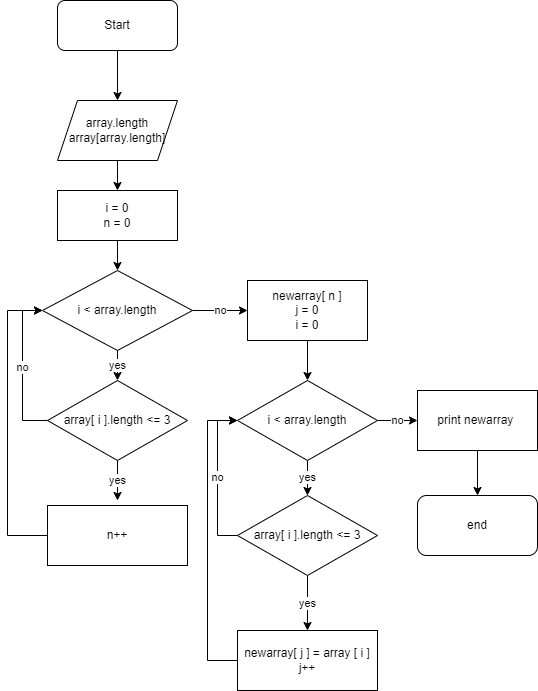

### Задача: Написать программу, которая из имеющегося массива строк формирует новый массив из строк, длина которых меньше, либо равна 3 символам. Первоначальный массив можно ввести с клавиатуры, либо задать на старте выполнения алгоритма. При решении не рекомендуется пользоваться коллекциями, лучше обойтись исключительно массивами.

**Для решения данной задачи я создал 3 метода на языке С#**
* Первый метод заполняет массив набором символов которые вводит пользователь.
```C#
string[] InitArray(int index)
{
    string[] array = new string[index];
    Console.WriteLine("Ввод содержимого массива");
    for (int i = 0; i < array.Length; i++)
    {
        Console.Write($"Введите элемент номер {i+1}: ");
        array[i] = Console.ReadLine();
    }
    return array;
}
```
* Второй метод выводит данный массив на экран.
```C#
void Print(string[] array)
{
    for (int i = 0; i < array.Length; i++)
    {
        Console.Write($" {array[i]} ");
    }
}
```
* Третий метод считает все элементы массива кторые мешьше либо равну *__3__* и заполняет новый массив  данными элементами. Алгоритм работы данного метода:



Полный код программы в папке Task.

*<u>Данная задача загружена на [GitHub](https://github.com/KruglovAleksey/NewTask.git "Мой GitHub")</u>*